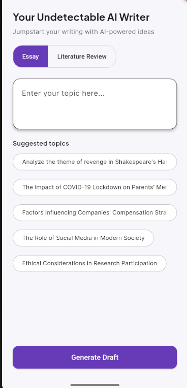

# Student AI App

<p align="center">
    
</p>

## Overview

Student AI App is a powerful Flutter application designed to help students efficiently manage their academic tasks. With an intuitive interface and AI-powered features, this app enables students to organize assignments, track deadlines, and boost productivity.

## Features

- **Task Management:** Add, edit, and delete assignments or tasks.
- **Deadline Tracking:** Get reminders for upcoming deadlines.
- **AI Assistance:** Receive smart suggestions for study schedules and task prioritization.
- **User-Friendly Interface:** Clean and simple design for easy navigation.
- **Cross-Platform:** Runs seamlessly on both Android and iOS devices.

## Installation

1. **Clone the repository:**
    ```bash
    git clone https://github.com/Pappyjay157/student_ai
    ```
2. **Navigate to the project directory:**
    ```bash
    cd student_ai_app
    ```
3. **Install dependencies:**
    ```bash
    flutter pub get
    ```
4. **Run the app:**
    ```bash
    flutter run
    ```

## Usage

- Launch the app on your emulator or physical device.
- Use the interface to add, edit, or delete tasks.
- Get AI-powered suggestions for managing your study schedule.

## Screenshot

The image below shows the main interface of the Student AI App:


## Contributing

Contributions are welcome! Please open an issue or submit a pull request for any improvements or bug fixes.

## License

This project is licensed under the [MIT License](LICENSE).

## Contact

For questions or support, please contact [ayooluwasamuel619@gmail.com](mailto:ayooluwasamuel619@gmail.com).